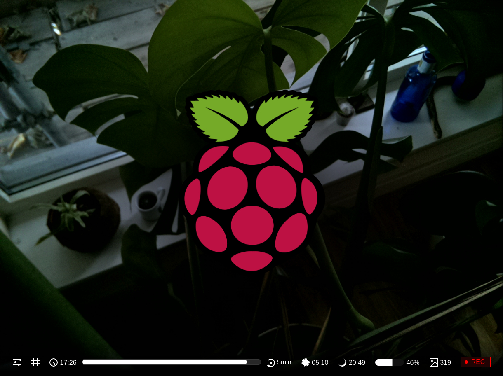
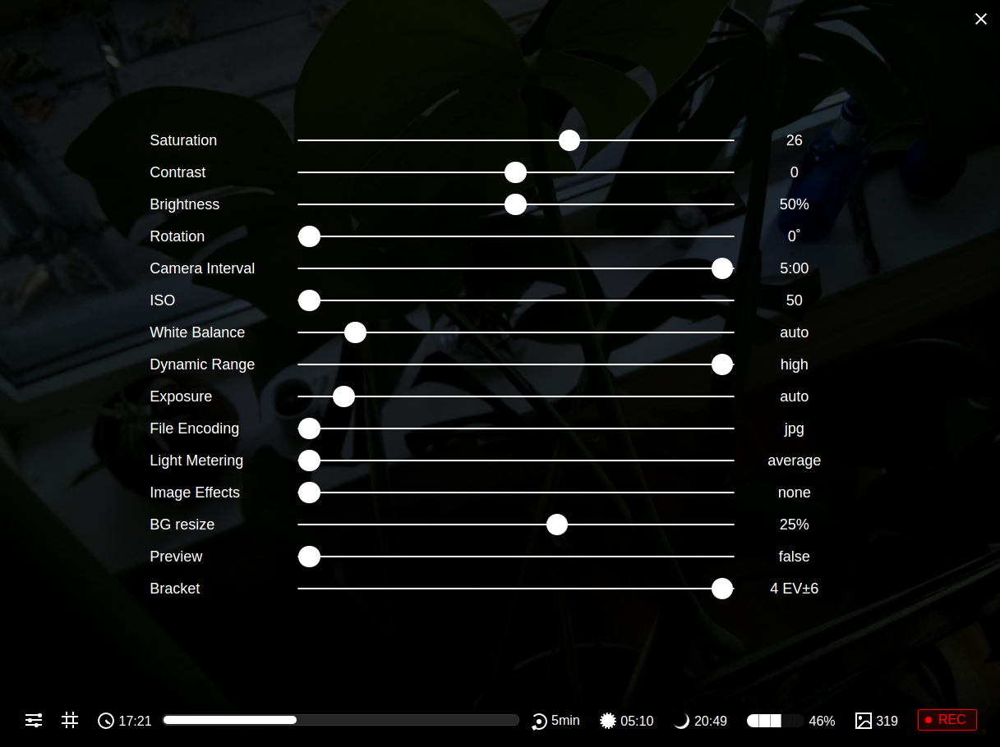

# Raspberry Spy

*A remote control interface for the Raspberry Pi camera (v2.0) using bash and  JavaScript.*

Essentially this project is a time-lapse utility, accessible via a browser, to control the camera. The back-end is a pure bash implementation, which uses WebSockets to read and write camera settings, that update interface metadata and change camera parameters in real-time.

**Icons from left to right:** settings menu, composition grid, last image time, progress bar, interval value, sunrise time, sunset time, disk usage, image count, recording status.

## Features overview

- **Daytime stop/start** - sync your camera's activity to dawn and dusk.
- **Time-lapse bracketing** - use exposure compensated images sequences.
- **Automatic space retrieval** - automatically backup and delete local photos.

## Camera settings

- **Standard options**: these values are according to the picamera values:
  -  `Saturation`, `Contrast`, `Brightness`, `Rotation`, `ISO`, `White Balance`, `Dynamic Range`, `Exposure`, `File Encoding`, `Light Metering` - .
- **Camera Interval** (a range slider of seconds and minutes)
- **Image Effects** a list of the default effects, applied with the default settings. 
  - `none`, `negative`, `solarise`, `sketch`, `denoise`, `emboss`, `oilpaint`, `hatch`, `gpen`, `pastel`, `watercolour`, `film`, `blur`, `saturation`, `colourswap`, `washedout`, `posterise`, `colourpoint`, `colourbalance`, `cartoon`

- **BG resize** (`10`, `20`, `25`, `33`, `50`, `100`) amount to resize the background image of the interface.
- **Work hours** (`Dawn to dusk` or `Always on`) 
  - "*Dawn to Dusk*" will resort to an external API to determine sunrise and sunset twilight time. Photos saved will between the start and stop time.
  - "*Always on*" will save images continuously. 
- **Preview** (`true` or `false`) when true images are **not** saved. 
- **Bracket** (`None`, `1xEV24`, `2xEV12`, `3xEV8`, `4xEV6`)  
- "None" - outputs a standard image according to the image settings
  - "1" to "4" - will take save bracketed LDR images. The bracketed images will ignore the ISO values and exposure settings, the camera will calculate those settings. 
    - 1 saves 3 images -24, 0, 24 EV (the highest fstop difference)
    - 2 saves 5 images: (separated by 12 stops) -24, -12, 0, 12, 24 EV
    - 3 saves 7 images: (separated by 8 stops) -24 -16 -8 0 8 16 24
    - 4 saves 9 images: (separated by 6 stops) -24 -18 -12 -6 0 6 12 18 24

## Worth mentioning

- [websocketd](https://github.com/joewalnes/websocketd) - is the library required to fulfil the bash WebSocket implementation. 
  - This project uses [version 0.3.1](https://github.com/joewalnes/websocketd/releases) which needs to be installed separately. 
  - You can download pre-compiled binaries for your OS  from [http://websocketd.com/](http://websocketd.com/)
- Daytime is provided by [sunrise-sunset.org](<https://sunrise-sunset.org/>) API (for sequences between sunrise and sunset)
- Auto-start, after power re-cycle, requires a `crontab @reboot` entry
- Daily maintenance requires an external `rsync` server (to backup and delete local images)

